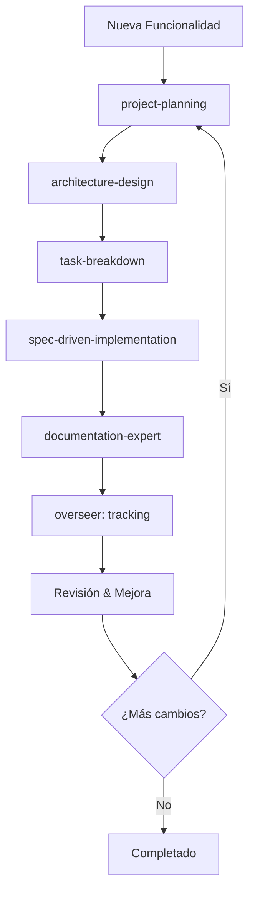

# Sistema de Copilot Instructions - Base Universal

Este directorio contiene un sistema de instrucciones para GitHub Copilot diseñado para ser aplicable a cualquier proyecto de software profesional.

## 📁 Estructura

### 1. [copilot-instructions.md](./copilot-instructions.md)
**Archivo original específico del proyecto WebServDev**
- Instrucciones específicas para la plataforma híbrida Neutralino/Electron
- Incluye paradigma de Estratega de Productividad
- Sirve como fuente para extraer principios universales

### 2. [universal-copilot-base.md](./universal-copilot-base.md) ⭐
**Principios Universales para Cualquier Proyecto**
- 10 Principios Fundamentales (DRY, SSOT, Autonomía, Testing, etc.)
- Metodologías de Trabajo (SMART, OKR, GTD, Eisenhower)
- Mejores Prácticas Técnicas
- Ciclo de Mejora Continua
- Checklist de Calidad Universal

**Usar este archivo como base para:**
- Nuevos proyectos
- Onboarding de desarrolladores
- Establecer estándares de calidad
- Revisar antes de cada commit

### 3. [skills-guide.md](./skills-guide.md) 🎯
**Guía de Skills de Claude para Soporte Integral**
- Inventario de skills instaladas
- Descripción de cada skill y su propósito
- Workflow recomendado integrando todas las skills
- Plan de acción para adopción
- Tips de uso y combinación

**Usar esta guía para:**
- Conocer qué skills están disponibles
- Activar skills apropiadas para cada tarea
- Seguir workflows estructurados
- Maximizar productividad con AI

### 4. [DISCOVERED_SKILLS.md](./DISCOVERED_SKILLS.md) 🆕
**Catálogo de 30+ Skills Descubiertas del Ecosistema**
- Skills adicionales encontradas con `find-skills`
- Top 5 skills críticas para instalar
- Mapa de skills por principio universal
- Casos de uso y comandos de instalación
- Plan de adopción por fases

**Usar este catálogo para:**
- Expandir capacidades del sistema
- Instalar skills según necesidades específicas
- Resolver pain points concretos
- Mejorar cobertura de principios universales

### 5. [SUMMARY.md](./SUMMARY.md) 📊
**Resumen Visual Ejecutivo del Sistema**
- Diagramas de flujo
- Comparaciones antes/después
- ROI esperado
- Referencias rápidas

**Usar este resumen para:**
- Entender el sistema de un vistazo
- Presentaciones a stakeholders
- Onboarding rápido

---

## 🚀 Inicio Rápido

### Para un Nuevo Proyecto

1. **Copia la base universal:**
   ```bash
   cp .github/universal-copilot-base.md ./PROJECT_STANDARDS.md
   ```

2. **Adapta a tu stack:**
   - Añade secciones específicas de tu tecnología
   - Mantén los 10 principios fundamentales intactos
   - Documenta decisiones arquitectónicas específicas

3. **Configura Copilot:**
   - Referencia `PROJECT_STANDARDS.md` en tus instrucciones de Copilot
   - Activa las skills relevantes para tu proyecto

4. **Revisa la guía de skills:**
   - Identifica qué skills necesitas para tu workflow
   - Instala skills adicionales si es necesario

### Para Desarrolladores del Proyecto Actual (WebServDev)

1. **Lee los principios universales:**
   ```bash
   code .github/universal-copilot-base.md
   ```

2. **Familiarízate con las skills:**
   ```bash
   code .github/skills-guide.md
   ```

3. **Revisa las instrucciones específicas del proyecto:**
   ```bash
   code .github/copilot-instructions.md
   ```

---

## 📊 Comparación de Archivos

| Archivo | Alcance | Audiencia | Actualización |
|---------|---------|-----------|---------------|
| `copilot-instructions.md` | Proyecto específico (WebServDev) | Equipo del proyecto | Frecuente (según evolución del proyecto) |
| `universal-copilot-base.md` | Universal (cualquier proyecto) | Cualquier desarrollador | Rara (principios fundamentales) |
| `skills-guide.md` | Skills de Claude instaladas | Usuarios de Claude Code | Media (al añadir/actualizar skills) |
| `DISCOVERED_SKILLS.md` | Catálogo de skills del ecosistema | Usuarios buscando expandir capacidades | Bajo demanda (al buscar nuevas skills) |
| `SUMMARY.md` | Resumen ejecutivo visual | Stakeholders, presentaciones | Rara (cambios mayores en el sistema) |

---

## 🎯 Los 10 Principios Fundamentales

Estos principios son la **esencia extraída** y aplicables universalmente:

1. **DRY Extremo** - Cero duplicación de funcionalidades
2. **Single Source of Truth** - Una fuente de verdad por concepto
3. **Autonomía del Asistente AI** - Logs primero, luego preguntar
4. **Nunca Supongas** - Verificar siempre, no asumir
5. **Nunca Molestes** - Resolver autónomamente cuando sea posible
6. **Testing Realista** - Sin trampas, tests que reflejan producción
7. **Consistencia entre Entornos** - Dev debe = Prod
8. **Logging Estratégico** - Sistema unificado y accionable
9. **Configuración Dinámica** - Sin hardcoding de rutas/valores
10. **Documentación como Código** - Docs viven junto al código

---

## 🛠️ Skills Instaladas y Disponibles

### Skills Core (Ya Instaladas)

| Skill | Propósito | Cuándo Usar |
|-------|-----------|-------------|
| `architecture-design` | Diseño de arquitectura estratégica | Decisiones de sistema, refactorings mayores |
| `documentation-expert` | Calidad y estructura de documentación | Problemas de docs, organización de contenido |
| `project-planning` | Planificación estructurada de proyectos | Transformar specs en planes de implementación |
| `spec-driven-implementation` | Implementación guiada por TDD | Implementar features diseñadas, ciclo TDD |
| `task-breakdown` | Desglose de tareas accionables | Convertir diseños en tareas implementables |
| `overseer` | Tracking multi-sesión | Trabajo que abarca múltiples sesiones |

### Skills Recomendadas (Pueden Instalarse)

- `legacy-codebase-analyzer` - Para proyectos con deuda técnica
- `find-skills` - Para descubrir skills adicionales

---

## 📖 Workflow Recomendado



### Pasos Detallados:

1. **Planificación** (`project-planning`)
   - Convertir requisitos en plan estructurado
   - Identificar componentes y dependencias

2. **Arquitectura** (`architecture-design`)
   - Diseñar estructura del sistema
   - Decidir patrones y tecnologías

3. **Desglose** (`task-breakdown`)
   - Crear tareas accionables
   - Establecer criterios de completitud

4. **Implementación** (`spec-driven-implementation`)
   - Seguir ciclo TDD (Red-Green-Refactor)
   - Implementar con tests primero

5. **Documentación** (`documentation-expert`)
   - Actualizar docs relevantes
   - Asegurar calidad y claridad

6. **Tracking** (`overseer`)
   - Seguimiento de progreso
   - Persistencia entre sesiones

7. **Revisión**
   - Aplicar checklist de calidad
   - Verificar cumplimiento de principios

---

## ✅ Checklist Pre-Commit

Antes de cada commit, verificar:

- [ ] ¿Cumple con el principio DRY?
- [ ] ¿Hay una única fuente de verdad?
- [ ] ¿Los tests son realistas y pasan?
- [ ] ¿El comportamiento es consistente Dev/Prod?
- [ ] ¿Los logs son informativos?
- [ ] ¿La configuración es dinámica?
- [ ] ¿La documentación está actualizada?
- [ ] ¿Se han verificado los resultados?
- [ ] ¿Es fácil de entender para otros?
- [ ] ¿El sistema puede auto-depurarse con los logs?

---

## 🔄 Mantenimiento

### Actualizar Principios Universales
Solo cuando cambien principios fundamentales de desarrollo (raro).

### Actualizar Instrucciones del Proyecto
Según evolucione la arquitectura o stack del proyecto específico.

### Actualizar Guía de Skills
Al instalar nuevas skills o cambiar el workflow recomendado.

---

## 📚 Referencias Adicionales

### Libros
- "Clean Code" - Robert C. Martin
- "The Pragmatic Programmer" - Hunt & Thomas
- "Refactoring" - Martin Fowler

### Principios de Diseño
- SOLID, KISS, YAGNI, DRY
- Composition over Inheritance
- Fail Fast, Principle of Least Surprise

### Metodologías
- SMART, OKR (objetivos)
- GTD, Eisenhower (priorización)
- TDD, Red-Green-Refactor (testing)

---

## 🤝 Contribuciones

Al actualizar estos archivos:

1. **Mantén la consistencia** entre los tres documentos
2. **Los principios universales** deben ser agnósticos de tecnología
3. **Las instrucciones del proyecto** pueden ser específicas
4. **La guía de skills** debe mantenerse actualizada con skills disponibles

---

## 📝 Historial de Cambios

- **2026-02-05**: Creación del sistema de base universal
  - Extracción de principios desde copilot-instructions.md
  - Creación de universal-copilot-base.md
  - Creación de skills-guide.md
  - Documentación de README.md

- **2026-02-05** (Actualización): Expansión del ecosistema de skills
  - Búsqueda exhaustiva con `find-skills` en 8 categorías
  - Descubrimiento de 30+ skills adicionales del ecosistema
  - Creación de DISCOVERED_SKILLS.md con catálogo completo
  - Identificación de Top 5 skills críticas
  - Mapa de skills por principio universal
  - Workflow extendido con 12 fases
  - Casos de uso y plan de adopción por fases

---

*Este sistema está diseñado para escalar desde proyectos individuales hasta organizaciones completas, manteniendo coherencia y calidad en todo el ciclo de desarrollo.*
