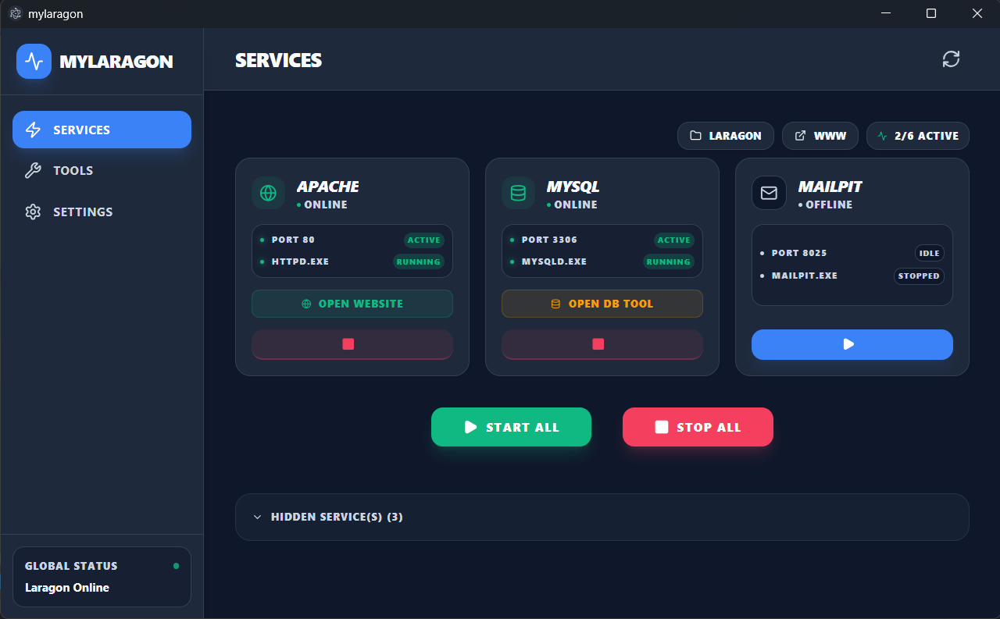

# WebServDev 🚀

**WebServDev** es un entorno de desarrollo moderno, visual y ampliable, diseñado como una herramienta independiente que ofrece una experiencia premium para la gestión de servidores locales.



## 🎯 Propósito

Este proyecto ofrece una plataforma completa de desarrollo con los siguientes objetivos:
- **Independencia Total**: Gestión propia de binarios y servicios sin dependencias externas.
- **Gestión Remota y Auto-actualizable**: Instalación de servicios (Apache, MySQL, PHP, etc.) desde la nube. La aplicación comprueba diariamente en segundo plano si existen nuevas versiones o paquetes disponibles para mantener tu entorno siempre al día.
- **Estructura Organizada**: Distribución de carpetas lógica y profesional (`/bin`, `/www`, `/etc`, etc.).
- **Interfaz Moderna**: Un dashboard visual interactivo diseñado para el desarrollo web de alto nivel.
- **Extensibilidad**: Sistema abierto para añadir nuevos servicios y herramientas personalizadas.

## ✨ Características Principales

- ⚡ **Control Total**: Instala, desinstala, inicia y detén servicios con un solo clic.
- 🌍 **Marketplace de Versiones**: Descarga versiones específicas de PHP, MySQL, Nginx, etc.
- 🔄 **Actualizaciones en Background**: Detección automática de nuevos paquetes cada 24 horas.
- 📂 **Estructura Profesional**: `/bin`, `/www`, `/etc`, `/data`, `/logs` perfectamente organizados.
- 🌍 **Multi-idioma**: Soporte para Español, Inglés, Alemán y más.
- 📊 **Monitoreo**: Estado de puertos y procesos en tiempo real.
- 🛠️ **Herramientas**: Terminal, Editor de Hosts, y gestión de proyectos integrados.

## 🚀 Requisitos de Uso

1. **Tener Laragon instalado** en tu sistema Windows.
2. Configurar la ruta de instalación de Laragon en el apartado de **Ajustes** dentro de WebServDev al abrirlo por primera vez.

## 🛠️ Desarrollo

Si quieres contribuir o compilar el proyecto tú mismo:

### Requisitos
- Node.js (v18 o superior)
- Laragon instalado en Windows

### Pasos
1. Clona el repositorio.
2. Instala las dependencias: `npm install`
3. Ejecuta en modo desarrollo (Vite): `npm run dev`

Opciones de ejecución en desarrollo:

- Ejecutar sólo la UI (Vite):

```bash
npm run dev
```

- Ejecutar la UI y Neutralino (ventana nativa ligera):

```bash
npm run dev
# en otra terminal (si prefieres correr neu manualmente):
cd neutralino && npx @neutralinojs/neu run
```

La aplicación soporta Neutralino como runtime más ligero que Electron. El proyecto incluye un subdirectorio `neutralino/` con `neutralino.config.json` y un shim que expone `window.electronAPI` para mantener la compatibilidad con la UI existente.
4. Para compilar el instalador (.exe): `npm run dist`

### Configurar la ruta de Laragon

La aplicación espera que introduzcas la ruta de instalación de Laragon en la interfaz de Ajustes la primera vez que la abras. También puedes preconfigurarla en `localStorage` usando la clave `WebServDev-config`. Ejemplo de contenido JSON:

```json
{
	"laragonPath": "C:\\laragon",
	"projectsPath": "C:\\laragon\\www",
	"editor": "code",
	"autoStart": false,
	"language": "es",
	"theme": "system"
}
```

## 🌍 Añadir Idiomas

Para añadir un nuevo idioma:
1. Crea un archivo `tu-idioma.json` en `src/i18n/`.
2. Define `"languageName": "Nombre del Idioma"`.
3. Traduce las claves. La app lo detectará automáticamente.

## 📄 Licencia

Este proyecto está bajo la Licencia MIT.
